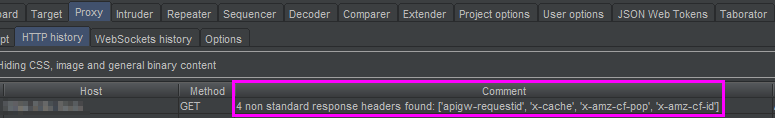
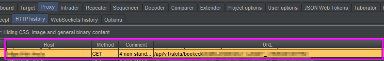
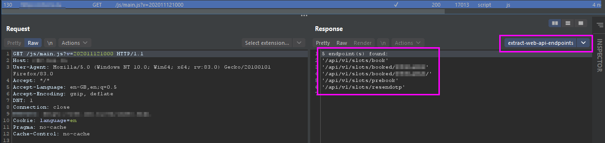
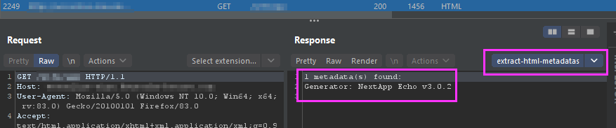
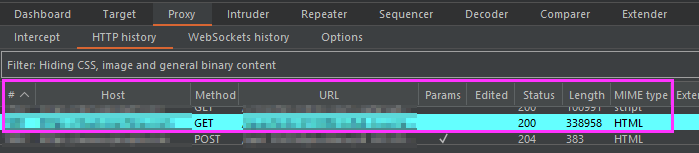
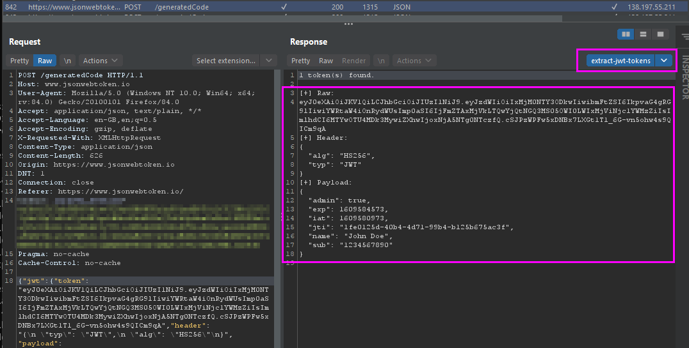

# Objective

Centralize and share all my custom scripts to be used with the [PIPER](https://portswigger.net/bappstore/e4e0f6c4f0274754917dcb5f4937bb9e) Burp extension.

[Documentation](https://blog.silentsignal.eu/2020/03/27/unix-style-approach-to-web-application-testing/) of the extension.

# Runtime requirements

> :information_source: No external dependencies needed.

Python >= **3.7** needed and in `PATH`.

```powershell
PS> python --version
Python 3.7.4
```

# Structure

Each script describes its goal in its header, for which PIPER tools is targeted to be used and instruction regarding if HTTP headers must be passed as well as filter to define:

```text
"""
PIPER script to ...
Target tool: [PIPER_TOOL]
[INSTRUCTION_IF_HTTP_HEADERS_MUST_BE_PASSED]
[FILTER_NEEDED_TO_BE_DEFINED]
"""
```

# Overview of the scripts behavior

## detect-non-standart-headers

Add a comment to the matching line in the proxy tab for every response containing non-standart HTTP headers.



## detect-request-to-web-api

Highlight the matching line in the proxy tab for every request that is made to a web api.



## extract-web-api-endpoints

Extract all API endpoints (*and URL like because it is hard to really identify if a URL is an API endpoint or not from a static point view*) from a JS script content obtained from a HTTP response.



## extract-html-metadatas

Extract interesting information from HTML META tags from a HTTP response. Mainly used to quickly identify which products/tools was used to build the site/application.



## detect-response-with-errors-disclosure

Detect HTTP responses containing a strack trace. Mainly used to quickly identify pages disclosing technical information via stack traces.



## extract-jwt-tokens

> :dart: This script was created in order to avoid the need to use another [extensions](https://portswigger.net/bappstore) or the [decoder](https://portswigger.net/burp/documentation/desktop/tools/decoder) to just see the content of the token.

Extract and pretty-display all [JWT](https://jwt.io/introduction) tokens present in a HTTP response.



# Configuration

> :warning: Change the script location path defined in **prefix** field for all custom scripts **before** to import the configuration.

> After the import, do not forget to enable the scripts because they are all disabled by default by the import command.

> For **Highlighters**, the color can be changed before the import by changing the **color** field to one constants supported by PIPER/BURP.

The file [piper-config.yaml](piper-config.yaml) contains the complete configuration that I use for all my custom scripts.
